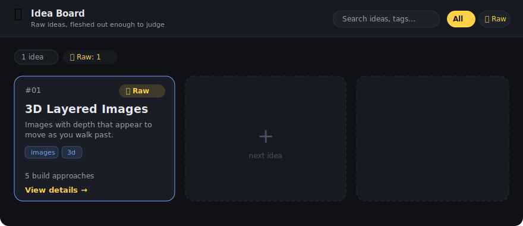

# Idea Board — Dashboard

An interactive, zero-dependency dashboard for capturing and browsing ideas.
Each idea is a **card**; click it to see everything captured about it — the core
idea, why it's interesting, ways to build it, the cheapest path to a demo, open
questions, and the next step.



## How to open it

It runs entirely in your browser. Nothing is uploaded anywhere.

- **Easiest:** double-click **`index.html`** — it opens straight in your browser.
- **Or** double-click a launcher (serves it on `http://localhost`, avoids any
  `file://` quirks):
  - **macOS / Linux** → `start-mac-linux.command`
  - **Windows** → `start-windows.bat`

## What it does

- **Card grid** of every idea, with status pill and tags.
- **Search** across titles, tags and text.
- **Filter** by status (Raw / Exploring / Building / Parked / Shipped).
- **Detail view** (click a card) with the full write-up: build-approach table
  with effort levels, step-by-step demo path, open questions, next step.
- **Live stats** of how many ideas sit in each status.

## Adding or editing ideas

All content lives in **`ideas.js`** — a plain list you edit by hand. Copy an
existing entry and change the fields:

```js
{
  id: "02",
  title: "Your idea",
  status: "raw",            // raw | exploring | building | parked | shipped
  tags: ["tag1", "tag2"],
  oneLiner: "One sentence summary.",
  coreIdea: "A paragraph explaining it.",
  whyInteresting: ["point", "point"],
  approaches: [
    { approach: "Name", medium: "Screen", how: "How it works", effort: "Low" },
  ],
  cheapestDemo: ["step 1", "step 2"],
  openQuestions: ["question?"],
  nextStep: "The single next action.",
  note: "Optional aside.",
}
```

Save, refresh the page, and the new card appears. Every field except `id`,
`title`, `status` and `oneLiner` is optional — leave any of them out and that
section simply won't render.

## Files

| File | Purpose |
|---|---|
| `index.html` | The dashboard shell |
| `ideas.js` | **Your data** — the list of ideas |
| `app.js` | Rendering, search, filter, detail modal |
| `styles.css` | Styling |
| `start-mac-linux.command` / `start-windows.bat` | Optional local-server launchers |
